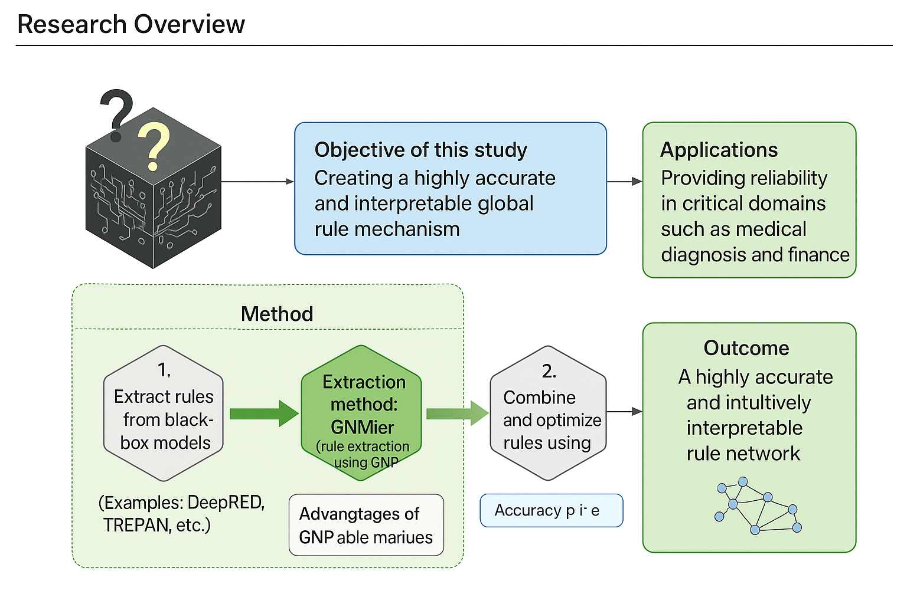

# 研究概要

## 背景
近年、深層学習や大規模機械学習モデルは高精度を達成している一方で、**意思決定の根拠がブラックボックス化**しており、医療・金融・産業など重要分野での活用に課題がある。  
従来のXAI技術（LIME, SHAP, Grad-CAMなど）は**個別予測（局所的）の説明は得られる**ものの、複数ルールの組み合わせや全体最適化を考慮した**大域的説明**までは扱えない。

## 目的
本研究の目的は、精度は高いが予測根拠が不明瞭な機械学習モデル（ブラックボックスモデル）から抽出した**if-thenルール群の最適な組み合わせ**を構築し、モデルの予測根拠を**人間が理解しやすく、かつ性能も維持できる形**で表現すること。

## 手法
1. ブラックボックスモデル（例: ニューラルネットワーク、勾配ブースティング木）から個別ルールを抽出  
   - 研究室の独自技術である **[遺伝的ネットワークプログラミング（GNP）](gnp.md)** を用いたルール抽出手法である **[GNMier](GNMier.md)** 
   - 既存のルール抽出手法（DeepRED, TREPAN, RuleFitなど）を活用

2. ルール群をノードとして 遺伝的ネットワークプログラミングで最適化  
   - ルールはノード、ルール間の論理的つながりはネットワークの枝として表現  
   - **GNPを用いた理由**：
     - **ノード間のつながりを考慮できる**ため、ルール同士の依存関係や順序を含む最適なネットワーク構造を探索可能  
     - 個別ルール（細胞）を組み合わせることで、**複数ルールからなる大きなルール（組織）** を生成でき、  
       組織が集まって **ネットワーク全体（個体）** として機能する構造を作り上げられる  
     - ヒューリスティック探索であるため、整数計画法のように数学的収束保証はないものの、組み合わせが膨大な問題でも全探索を避けつつ、効率的に高品質な解を得られる  
     - 適応度関数に「予測精度＋説明容易性」を組み込むことで、精度を維持しつつ、人間に理解可能なルールネットワーク（個体）を構築可能
     - 具体的な **[GNP設計図](gnp_architecture.md)**

3. 他のXAI手法（LIME, SHAP, Grad-CAM）と比較すると、  
   - 個別予測の説明だけでなく、**ルール全体の最適化＋依存関係の可視化＋大きなルール（組織）の生成**が可能

4. 手法の概要図

## 成果
- 従来のあてはめるルールをすべて使う手法と比較して精度が5％以上向上
- 可視化されたルールネットワークにより、意思決定の論理が直感的に理解可能 

## 応用
- 医療診断モデル：AI予測の根拠を医師に提示  
- 金融審査モデル：決定理由の透明化による規制対応  
- 製造業予測システム：保守判断や異常検知の説明可能化

